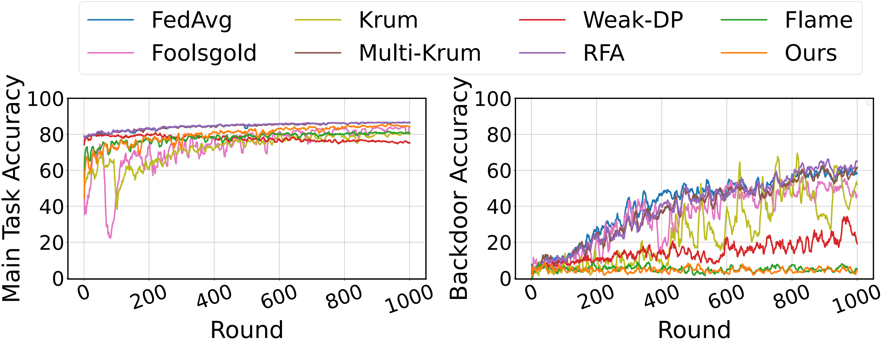

# Multi-metrics

This codebase is the official PyTorch implementation of our paper:

***Multi-metrics adaptively identifies backdoors in Federated learning***

>**Abstract.** The decentralized and privacy-preserving nature of federated learning (FL) makes it vulnerable to backdoor attacks aiming to manipulate the behavior of the resulting model on specific adversary-chosen inputs. However, most existing defenses based on statistical differences take effect only against specific attacks, especially when the malicious gradients are similar to benign ones or the data are highly non-independent and identically distributed (non-IID). In this paper, we revisit the distance-based defense methods and discover that i) Euclidean distance becomes meaningless in high dimensions and ii) malicious gradients with diverse characteristics cannot be identified by a single metric. To this end, we present a simple yet effective defense strategy with multi-metrics and dynamic weighting to identify backdoors adaptively. Furthermore, our novel defense has no reliance on predefined assumptions over attack settings or data distributions and little impact on the benign performance. To evaluate the effectiveness of our approach, we conduct comprehensive experiments on different datasets under various attack settings, where our method achieves the best defense performance. For instance, we achieve the lowest backdoor accuracy of $3.06%$ under the difficult Edge-case PGD, showing significant superiority over previous defenses. The results also demonstrate that our method can be well-adapted to a wide range of non-IID degrees without sacrificing the benign performance. 

## Citation
If you find our work useful in your research, please consider citing:
```
@article{huang2023multi,
  title={Multi-metrics adaptively identifies backdoors in Federated learning},
  author={Huang, Siquan and Li, Yijiang and Chen, Chong and Shi, Leyu and Gao, Ying},
  journal={arXiv preprint arXiv:2303.06601},
  year={2023}
}
```

## Results

The source results of various defenses against Edge-case PGD attack are in `log`.
The figure shows MA(%) and BA(%) of various defenses under Edge-case PGD attack.



## Getting Started

```bash
cd multi-metrics/codebase
conda create -n multi-metrics python=3.6.9
conda activate multi-metrics
pip install -r requirements.txt
```

## Data preparation

The backdoor dataset SouthWest Airlines for CIFAR10 is in the project. To get backdoor dataset Ardis for MNIST/EMNIST please see **[edgecase_backdoors](https://github.com/SanaAwan5/edgecase_backdoors)**, which is the official code of the Edge-case attack. 

## Usage

#### example command

The follow command is to conduct Multi-metrics (ous) defense to defend against Edge-case PGD attack on CIFAR10. Please see **[edgecase_backdoors](https://github.com/SanaAwan5/edgecase_backdoors)** to get detailed description on the arguments of FL system.

```bash
python simulated_averaging.py \
--lr 0.02 \
--gamma 0.998 \
--num_nets 200 \
--fl_round 1500 \
--part_nets_per_round 10 \
--local_train_period 2 \
--adversarial_local_training_period 2 \
--dataset cifar10 \
--model vgg9 \
--fl_mode fixed-freq \
--defense_method multi-metrics \
--attack_method pgd \
--attack_case edge-case \
--model_replacement False \
--project_frequency 10 \
--stddev 0.0025 \
--eps 2 \
--adv_lr 0.02 \
--prox_attack False \
--poison_type southwest \
--norm_bound 2 \
--device=cuda\
```


## Acknowledgement

We thank **[edgecase_backdoors](https://github.com/SanaAwan5/edgecase_backdoors)** for their amazing open-sourced project! We just add our Multi-metrics defense to this project.

